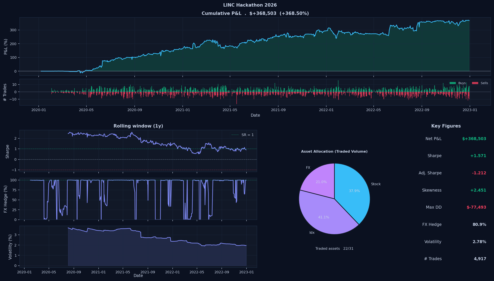

# Quadratic – LINC Hackathon 2026 Submission 
## Ranked #1 in Performance



## Summary

We developed a multi-strategy systematic trading approach combining statistical arbitrage, cross-sectional momentum, and index mispricing.

The portfolio is split into three independent sleeves:

1. **Statistical Arbitrage (Pairs / Volatility Spread)**
   - Mean-reversion on spreads between indices and equities
   - Idx_01 (VIX-like instrument) used as a volatility leg against equity exposure
   - Rolling beta estimation and z-score normalization
   - Residual-based position sizing with capped signals
   - Asymmetric entry logic for volatility-related trades

2. **Cross-Sectional Momentum + Beta Hedge**
   - Monthly ranking of equities based on past returns
   - Long top performers
   - Dynamic beta-neutralization using index hedging (Idx_04)
   - Capital reallocation at rebalance dates

3. **ETF vs Synthetic Basket Arbitrage**
   - Constructs a synthetic index from underlying equities
   - Trades mispricing between ETF (Idx_04) and synthetic basket
   - Z-score based entry/exit with capped leverage
   - Dollar-neutral structure

The final portfolio aggregates all three sleeves and applies a **global FX hedge** at the portfolio level.

## Key Characteristics

- Multi-strategy diversification
- Volatility harvesting via equity–VIX spreads
- Explicit beta control
- Systematic FX exposure neutralization
- Scalable capital allocation across independent sleeves
- Rule-based position sizing and execution

## Results

- Total return: ~368% over three years
- Substantially higher than other submissions (typically ~10–75%)
- Low drawdown relative to return
- Consistent performance across the full period

## Notes

The implementation follows the competition rules, including the ability to use short exposure to scale positions. The resulting portfolio reflects an aggressive but systematic use of available capital within the defined framework.

## Usage

Run the strategy:

```bash
python algorithm.py
